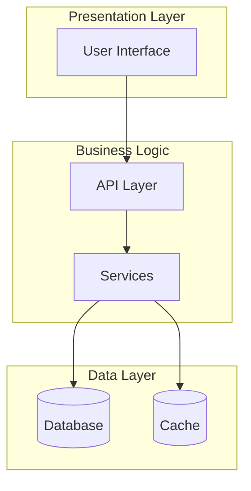

# Comprehensive Codebase Analysis

**Project:** {{.ProjectName}}
**Analysis Date:** {{.AnalysisDate}}
**Powered by:** [AI Distiller (aid) v{{VERSION}}]({{WEBSITE_URL}}) ([GitHub](https://github.com/janreges/ai-distiller))

You are a **Principal Software Architect** with expertise in system design, security, performance optimization, and software engineering best practices. Perform a comprehensive analysis of the provided codebase.

## 🎯 Analysis Scope

Analyze the codebase across multiple dimensions and provide a holistic assessment covering:

1. **Architecture & Design** (30% weight)
2. **Security Posture** (25% weight)
3. **Performance & Scalability** (20% weight)
4. **Code Quality & Maintainability** (15% weight)
5. **Best Practices Adherence** (10% weight)

## 📊 Required Deliverables

### 1. Executive Summary (1 page)

Provide a concise overview including:
- Overall project health score (0-100) with breakdown by dimension
- Top 3 strengths of the codebase
- Top 3 critical issues requiring immediate attention
- Recommended priority actions (30/60/90 day plan)

### 2. Architecture Analysis

#### 2.1 System Architecture Diagram

Create a high-level architecture diagram using Mermaid syntax:

#### 2.2 Component Analysis

For each major component/module:
- **Purpose:** What it does
- **Dependencies:** What it depends on
- **Dependents:** What depends on it
- **Coupling Score:** Low/Medium/High
- **Cohesion Score:** Low/Medium/High
- **Recommendations:** Improvements needed

#### 2.3 Design Patterns Identified

List design patterns used (correctly and incorrectly):
- Pattern name
- Where it's used
- Assessment (Proper/Improper/Could be improved)
- Recommendations

### 3. Security Assessment

#### 3.1 Vulnerability Matrix

| Category | Severity | Count | Examples | Mitigation Priority |
|----------|----------|-------|----------|-------------------|
| Injection | Critical | X | SQL injection in UserService | Immediate |
| Authentication | High | X | Weak password policy | 30 days |
| Authorization | Medium | X | Missing role checks | 60 days |

#### 3.2 Security Checklist

- [ ] Input validation on all external inputs
- [ ] Output encoding for all dynamic content
- [ ] Authentication mechanisms properly implemented
- [ ] Authorization checks at appropriate levels
- [ ] Sensitive data properly encrypted
- [ ] Security headers configured
- [ ] Dependencies up to date and secure
- [ ] No hardcoded secrets or credentials
- [ ] Proper error handling without information leakage
- [ ] Audit logging for security events

### 4. Performance Analysis

#### 4.1 Performance Hotspots

Identify and rank performance issues:

1. **Issue:** [Description]
   - **Impact:** Response time / Resource usage
   - **Location:** File:line
   - **Current Complexity:** O(n²)
   - **Optimized Complexity:** O(n log n)
   - **Estimated Improvement:** 80% reduction in processing time

#### 4.2 Scalability Assessment

- **Current Capacity:** Estimated concurrent users/requests
- **Bottlenecks:** Primary limiting factors
- **Horizontal Scalability:** Yes/No/Partial
- **Vertical Scalability:** Yes/No/Partial
- **Recommendations:** Specific improvements

### 5. Code Quality Metrics

#### 5.1 Quantitative Metrics

| Metric | Current Value | Industry Standard | Assessment |
|--------|---------------|------------------|------------|
| Cyclomatic Complexity | X | <10 | Needs Work |
| Code Coverage | X% | >80% | Good |
| Technical Debt Ratio | X% | <5% | Critical |
| Duplication | X% | <3% | Acceptable |

#### 5.2 Qualitative Assessment

Rate each area (1-10):
- **Readability:** How easy is the code to understand?
- **Modularity:** How well is the code organized into modules?
- **Testability:** How easy is it to write tests?
- **Documentation:** How well documented is the code?
- **Consistency:** How consistent are coding patterns?

### 6. Best Practices Compliance

#### 6.1 Language-Specific Best Practices

Based on the primary language(s) used, assess compliance with:
- Naming conventions
- Project structure
- Error handling patterns
- Resource management
- Async/concurrent programming patterns

#### 6.2 General Engineering Practices

- [ ] Version control used effectively
- [ ] CI/CD pipeline present and functional
- [ ] Code review process evident
- [ ] Testing strategy implemented
- [ ] Documentation maintained
- [ ] Monitoring and logging implemented
- [ ] Error handling consistent
- [ ] Configuration externalized

### 7. Dependency Analysis

#### 7.1 Dependency Health

| Dependency | Version | Latest | Security Issues | License | Risk Level |
|-----------|---------|--------|----------------|---------|------------|
| framework | 2.1.0 | 3.0.0 | 2 High | MIT | Medium |

#### 7.2 Dependency Graph

Create a simplified dependency graph showing critical dependencies.

### 8. Technical Debt Inventory

Categorize and prioritize technical debt:

#### 8.1 Critical Debt (Must Fix)
- **Item:** Description
- **Impact:** Business/Technical impact
- **Effort:** Estimated hours
- **ROI:** High/Medium/Low

#### 8.2 Important Debt (Should Fix)
[Similar structure]

#### 8.3 Nice-to-Have Improvements
[Similar structure]

### 9. Recommendations & Roadmap

#### 9.1 Immediate Actions (Week 1)
1. [Critical security fix]
2. [Performance hotfix]
3. [Breaking bug fix]

#### 9.2 Short-term Improvements (Month 1)
1. [Refactoring priority areas]
2. [Adding missing tests]
3. [Documentation updates]

#### 9.3 Long-term Strategic Changes (Quarter)
1. [Architecture improvements]
2. [Technology migrations]
3. [Process improvements]

### 10. Risk Assessment

| Risk | Probability | Impact | Mitigation Strategy |
|------|------------|--------|-------------------|
| Data breach | Medium | Critical | Implement security audit |
| Performance degradation | High | High | Add monitoring |
| Technical debt overflow | High | Medium | Allocate refactoring time |

## 🏁 Analysis Methodology

Use these techniques in your analysis:
1. **Static Analysis:** Examine code structure and patterns
2. **Dependency Analysis:** Map component relationships
3. **Complexity Analysis:** Identify overly complex areas
4. **Security Scanning:** Look for common vulnerabilities
5. **Performance Profiling:** Identify bottlenecks
6. **Best Practices Audit:** Check against industry standards

## 📋 Output Format

Structure your response with clear sections, use tables for data, include code examples where relevant, and provide actionable recommendations with specific file/line references where applicable.

---

## 🚀 Begin Analysis

The following is the distilled codebase for comprehensive analysis:

---
*This analysis report was generated using [AI Distiller (aid) v{{VERSION}}]({{WEBSITE_URL}}), authored by [Claude Code](https://www.anthropic.com/claude-code) & [Ján Regeš](https://github.com/janreges) from [SiteOne](https://www.siteone.io/). Explore the project on [GitHub](https://github.com/janreges/ai-distiller).*