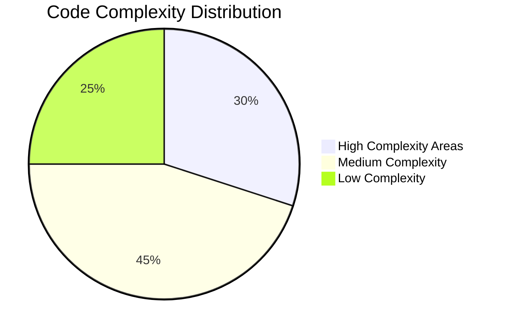
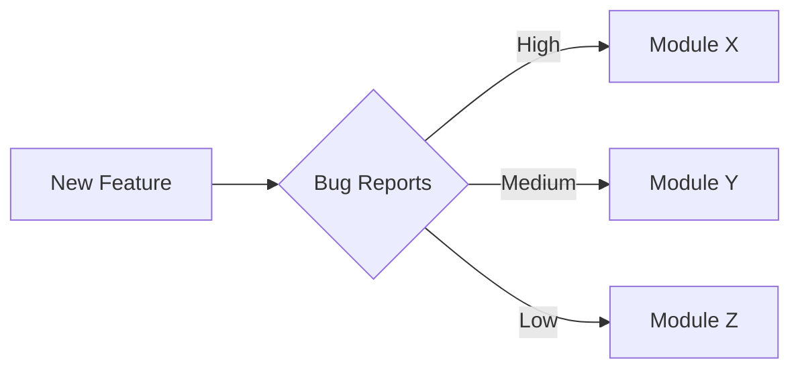

You are a seasoned software archeologist and senior engineer.
Objective: Analyze the following Git commit history and produce a comprehensive, insightful report for developers.

*Analysis powered by [AI Distiller (aid)](https://github.com/janreges/ai-distiller) ([GitHub](https://github.com/janreges/ai-distiller))*

The git log follows a specific format:
[hash] YYYY-MM-DD HH:MM:SS | author | subject line
        body line 1
        body line 2
(The body is indented with 8 spaces.)

Output requirements - create these sections using Markdown:

## 1. Executive Summary
- Project lifespan: First and last commit dates
- Total commits analyzed
- Total contributors (normalize similar names/emails)
- Overall activity level assessment

## 2. Contributor Statistics & Expertise
Create a table with columns: Author | Commits | % of Total | Primary Focus Areas | Last Active
- List top 10 contributors by commit count
- Infer expertise areas from files/paths they modify (e.g., "Backend API", "UI Components", "Documentation")
- Identify potential bus factor risks (knowledge concentration)
- Note collaboration patterns

## 3. Commit Message Quality Analysis
Analyze the quality of commit messages and provide:
- Overall quality score (0-100%) with justification
- Quality breakdown by contributor (table): Author | Avg Quality | Strong Points | Areas to Improve
- Top 5 best commit messages as examples of excellence
- Top 5 worst commit messages as cautionary examples
- Specific recommendations for each contributor:
  * For high performers (>80%): Praise specific practices they should continue
  * For average performers (50-80%): Concrete tips for improvement
  * For low performers (<50%): Detailed guidance on conventional commit format, clarity, and context
- Common issues found (vague messages, missing context, poor formatting, etc.)

## 4. Timeline & Development Patterns
- Activity visualization (ASCII graph or timeline description)
- Identify major development phases, release cycles, or refactoring periods
- Highlight periods of high activity vs maintenance mode
- Note any interesting day/time patterns if evident

## 5. Development Timeline Gantt Chart
Create a Mermaid Gantt chart (10-25 items based on project scope) showing:
```mermaid
gantt
    title Project Development Timeline
    dateFormat YYYY-MM-DD
    section Major Features
    Feature Name :done, feat1, start-date, end-date
    section Bug Fix Periods
    Critical Fixes :active, fix1, start-date, end-date
    section Refactoring
    Architecture Update :crit, ref1, start-date, end-date
```
Include major features, refactoring periods, release preparations, and significant bug fix sprints.

## 6. Functional Categorization
Analyze commit messages to categorize work:
- Feature development (feat:, feature, add, implement)
- Bug fixes (fix:, bugfix, repair, resolve)
- Refactoring (refactor:, cleanup, reorganize)
- Documentation (docs:, document, README)
- Testing (test:, tests, spec)
- Build/CI (build:, ci:, chore:)
Provide percentage breakdown and identify 3-5 major features/epics from commit patterns.

## 7. Complexity & Problem Areas Analysis
Identify the most complicated parts of the project:
- Files/modules with highest churn (most frequent changes)
- Areas with most bug fixes (potential quality issues)
- Components with repeated refactoring (design challenges)
- Create a Mermaid diagram visualizing problem areas:

Or use a flowchart/graph to show relationships between problematic components.

## 8. Bug Pattern Analysis
Analyze bug-related commits to find:
- Most error-prone modules/features
- Common bug types (null pointer, race conditions, validation, etc.)
- Bug fix velocity over time
- Correlation between features and subsequent bug fixes
- Create visualization if patterns emerge:


## 9. Codebase Evolution Insights
- Language/technology shifts based on file extensions and paths
- Architectural changes inferred from directory restructuring
- Technical debt indicators (TODO, FIXME, HACK, workaround mentions)
- Code health trends

## 10. Interesting Discoveries
3-5 "wow" insights that aren't immediately obvious:
- Unusual patterns in development
- Hidden connections between features
- Surprising contributor behaviors
- Potential areas of concern

## 11. Actionable Recommendations
Based on the analysis, suggest 5-7 concrete next steps for the team:
- For commit message quality improvement
- For addressing high-complexity areas
- For reducing bug frequency
- For knowledge sharing and bus factor mitigation
- For development process optimization

Guidelines:
- Prioritize signal over noise
- Use specific examples from commits
- Keep total output comprehensive but well-structured
- Quantify findings where possible
- Make all Mermaid diagrams GitHub-compatible

---
*This report was generated using [AI Distiller (aid)](https://github.com/janreges/ai-distiller), authored by [Claude Code](https://www.anthropic.com/claude-code) & [Ján Regeš](https://github.com/janreges) from [SiteOne](https://www.siteone.io/). Explore the project on [GitHub](https://github.com/janreges/ai-distiller).*